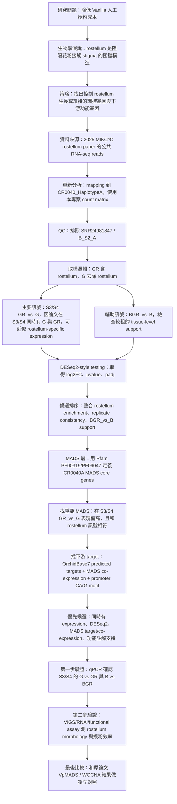

# CR0040A Rostellum Experiment Logic Flowchart

```mermaid
flowchart TD
    A["研究問題：降低 Vanilla 人工授粉成本"] --> B["生物學假說：rostellum 是阻隔花粉接觸 stigma 的關鍵構造"]
    B --> C["策略：找出控制 rostellum 生長或維持的調控基因與下游功能基因"]

    C --> D["資料來源：2025 MIKC^C rostellum paper 的公共 RNA-seq reads"]
    D --> E["重新分析：mapping 到 CR0040_HaplotypeA，使用本專案 count matrix"]
    E --> F["QC：排除 SRR24981847 / B_S2_A"]

    F --> G["取樣邏輯：GR 含 rostellum，G 去除 rostellum"]
    G --> H["主要訊號：S3/S4 GR_vs_G，因論文在 S3/S4 同時有 G 與 GR，可近似 rostellum-specific expression"]
    G --> I["輔助訊號：BGR_vs_B，檢查較粗的 tissue-level support"]

    H --> J["DESeq2-style testing：取得 log2FC、pvalue、padj"]
    I --> J
    J --> K["候選排序：整合 rostellum enrichment、replicate consistency、BGR_vs_B support"]

    K --> L["MADS 層：用 Pfam PF00319/PF09047 定義 CR0040A MADS core genes"]
    L --> M["找重要 MADS：在 S3/S4 GR_vs_G 表現偏高，且和 rostellum 訊號相符"]
    M --> N["找下游 target：OrchidBase7 predicted targets + MADS co-expression + promoter CArG motif"]

    N --> O["優先候選：同時有 expression、DESeq2、MADS target/co-expression、功能註解支持"]
    O --> P["第一步驗證：qPCR 確認 S3/S4 的 G vs GR 與 B vs BGR"]
    P --> Q["第二步驗證：VIGS/RNAi/functional assay 測 rostellum morphology 與授粉效率"]
    Q --> R["最後比較：和原論文 VpMADS / WGCNA 結果做獨立對照"]
```
